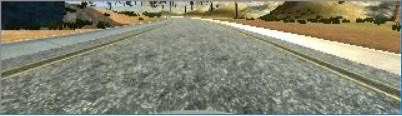
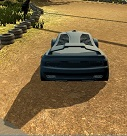
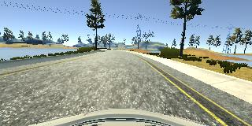
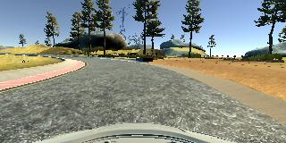
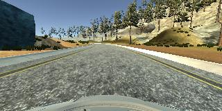
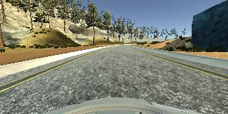

# **Behavioral Cloning** 

## Project Writeup

**Behavioral Cloning Project**

The goals / steps of this project are the following:
* Use the simulator to collect data of good driving behavior
* Build, a convolution neural network in Keras that predicts steering angles from images
* Train and validate the model with a training and validation set
* Test that the model successfully drives around track one without leaving the road
* Summarize the results with a written report

## Rubric Points
### Here I will consider the [rubric points](https://review.udacity.com/#!/rubrics/432/view) individually and describe how I addressed each point in my implementation.  

### Files Submitted & Code Quality

#### 1. Submission includes all required files and can be used to run the simulator in autonomous mode

My project includes the following files:
* model.py containing the script to create and train the model
* drive.py for driving the car in autonomous mode
* model.h5 containing a trained convolution neural network 
* writeup_report.md and writeup_report.ipynb summarizing the results
* submission_imgs a folder containing images used in this writeup.

#### 2. Submission includes functional code
Using the Udacity provided simulator and my drive.py file, the car can be driven autonomously around the track by executing 
```sh
python drive.py model.h5
```

#### 3. Submission code is usable and readable

The model.py file contains the code for training and saving the convolution neural network. The file shows the pipeline I used for training and validating the model, and it contains comments to explain how the code works. I used generators to process data in batches to overcome memory issues during training.

### Model Architecture and Training Strategy

My model architecture is listed with all details below and here is a summary of the same. Each image is first cropped, normalized followed by three convolution layers and maxpool layers. Then flattened and goes through three fully connected layers to output single neuron as the steering angle. 

#### Cropped Image



Model is trained with batch size of 16 using python generators to overcome memory limitations. A train data set of 80% is separated from over all data. It is shuffled before split and each batch from generator is also shuffled to help generalize learning.

For training, I drove the car in simulator and collected data of three laps. These are neat laps staying in centre of road. I avoided collecting data by going reverse side of lap as I augmented data with flipping the image and steering angles in opposite direction.

Since track is mostly turning the model tends to over learn left turns. To avoid this each image is flipped vertically and its steering angle is reversed. This also resulted in data augmentation process rather than obtain more and more training data. Initially I trained the model with only centre camera input, however the car in simulaor wobbled a way too much towards either side of the road. Steering angle got smoothened once I used the images and adjusted steering agnles from the left and right cameras too, followed by same data augmentation process as above.

#### 1. An appropriate model architecture has been employed

My model consists of a convolution neural network with 3x3 filter sizes and depths between 24 and 64 (model.py lines 88-95) 

The model includes RELU layers to introduce nonlinearity (code lines 88, 90, 92 & 94), and the data is normalized in the model using a Keras lambda layer (code line 85). 

My model's architecture starts with cropping the input image of 160x320 (HxW) to a 90x320 image (model.py line 83). This is because for the model to predict steering angle, only the road an lane lines detail is sufficient. Other data from camera images is not useful. The data is then normalized to values between -0.5 to 0.5 for computational efficiency (code line 85).

Post pre-processing, the convolutional NN begins here with three layers (model.py lines 88-95). First layer is 24 5x5 filters as I wanted to capture finer details. My intuition for not using finer filters of 3x3 was that it might tend to overfit to the data. Next layer is a set of 36 5x5 filters. This should learn mid level features followed by 48 3x3 filters that convolve the earlier layers. The last layer is 64 3x3 filters that look for high-level features. Each of these CNN layers are also downsampled by MaxPooling to throw away some of the spatial information, so the conv layer learns there is a specific feature, and not exactly where in the input.

This layer is followed by three fully connected layers of 100, 50 and 10. Last is the single neuron that outputs the steering angle (model.py lines 98 to 104).

#### 2. Attempts to reduce overfitting in the model

The model contains dropout layers in order to reduce overfitting (model.py lines 100 & 102). 

The model was trained and validated on different data sets to ensure that the model was not overfitting (code line 116-118). The model was tested by running it through the simulator and ensuring that the vehicle could stay on the track.

#### 3. Model parameter tuning

The model used an adam optimizer, so the learning rate was not tuned manually (model.py line 107).

#### 4. Appropriate training data

Training data was chosen to keep the vehicle driving on the road. I used a combination of center lane driving, recovering from the left and right sides of the road. 

For details about how I created the training data, see the next section. 

### Model Architecture and Training Strategy

#### 1. Solution Design Approach

The overall strategy for deriving a model architecture was to ...

My first step was to use a convolution neural network model similar to the Nvidia paper. I thought this model might be appropriate because it has a neat range of filter depths. Neither too large nor too small.

In order to gauge how well the model was working, I split my image and steering angle data into a training and validation set. I found that my first model had a low mean squared error on the training set but a high mean squared error on the validation set. This implied that the model was overfitting. 

To combat the overfitting, I modified the model so that it is less complicated now and added dropout layers. I also adjusted the filter and depth sizes limiting both convolution and fully connected layers to three. I also added MaxPool layers after each activation layer.

Then I removed the longest fully connected layer and introduced my own fully connected layers.

The final step was to run the simulator to see how well the car was driving around track one. There were a few spots where the vehicle fell off the track... to improve the driving behavior in these cases, I ....

At the end of the process, the vehicle is able to drive autonomously around the track without leaving the road.

#### 2. Final Model Architecture

The final model architecture (model.py lines 83-104) consisted of a convolution neural network with the following layers and layer sizes.

____________________________________________________________________________________________________
Layer (type) - Output Shape - Param #
##### ====================================================================================================
cropping2d_1 (Cropping2D)        (None, 90, 320, 3)    0      
lambda_1 (Lambda)                (None, 90, 320, 3)    0      
convolution2d_1 (Convolution2D)  (None, 86, 316, 24)   1824   
maxpooling2d_1 (MaxPooling2D)    (None, 43, 158, 24)   0      
convolution2d_2 (Convolution2D)  (None, 39, 154, 36)   21636  
maxpooling2d_2 (MaxPooling2D)    (None, 19, 77, 36)    0      
convolution2d_3 (Convolution2D)  (None, 17, 75, 48)    15600  
maxpooling2d_3 (MaxPooling2D)    (None, 8, 37, 48)     0      
convolution2d_4 (Convolution2D)  (None, 6, 35, 64)     27712  
maxpooling2d_4 (MaxPooling2D)    (None, 3, 17, 64)     0      

flatten_1 (Flatten)              (None, 3264)          0      
dense_1 (Dense)                  (None, 100)           326500 
dropout_1 (Dropout)              (None, 100)           0      
dense_2 (Dense)                  (None, 50)            5050   
dropout_2 (Dropout)              (None, 50)            0      
dense_3 (Dense)                  (None, 10)            510    
dense_4 (Dense)                  (None, 1)             11     
##### ======================================================
Total params: 398,843


#### 3. Creation of the Training Set & Training Process

To capture good driving behavior, I first recorded three laps on track one using center lane driving. Here is an example image of center lane driving:

I then recorded the vehicle recovering from the left side and right sides of the road back to center so that the vehicle would learn to recover and not run off the road edges. I chose the recover data in such a way that the car doesn't even cross the left and right lane markings.As it reaches that spot, I collected only the recovery action and fed into the training. These images show what a recovery looks like starting from ... :

#### Going off road 1


#### Going off road 2


These spots are the first left turn (before the bridge), after the bridge towards the open patch (at sharp left turn) and at around the sharp right turn, I needed to collect more data by recording only the recover actions several times (3-5) at these locations. This helped the model learn to recover and do not cross the lane markings.

#### Recovery Image 1


#### Recovery Image 2


#### Recovery Image 3


To augment the data sat, I also flipped images and angles thinking that this would also teach the model to generalize to turning right also. For example, here is an image that has then been flipped:

#### Normal Image

#### Flipped Image



After the collection process, I had 51417 number of data points. I then preprocessed this data by flipping each image reversing the corresponding steering angle. i then cropped 50 pixels from the top and 20 from bottom. The data point is then scaled down to a value between -0.5 to 0.5.

Finally I randomly shuffled the data set and put 20% of the data into a validation set. 

I used this training data for training the model. The validation set helped determine if the model was over or under fitting. The ideal number of epochs was 5 and used an adam optimizer so that manually training the learning rate wasn't necessary.

#### 4. Final Results

With above model, the car in sumulator successfully goes around the track keeping itself neatly in centre of road all time. The fastest speed tested is 15 for stability. Also the resolution is to be set to 1024x768 considering my computer's memory limitations.

### Next steps

Literature says ELUs work better and are faster than RELUs, so as next steps I like to use ELUs to train the model and benchmark results. Also try proper Nvidia and Comma.ai architectures to understand differences and enhance my architecture.

Current model although stays on road for most part, wobbles a way too much at higher speeds than 15. This will be the other problem I like to tackle and make model robust.
