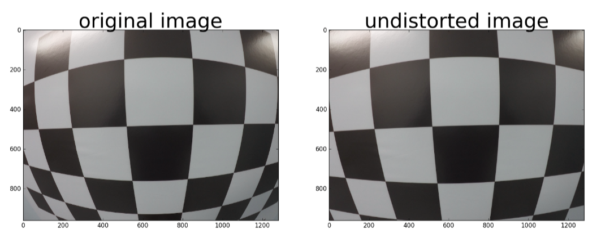
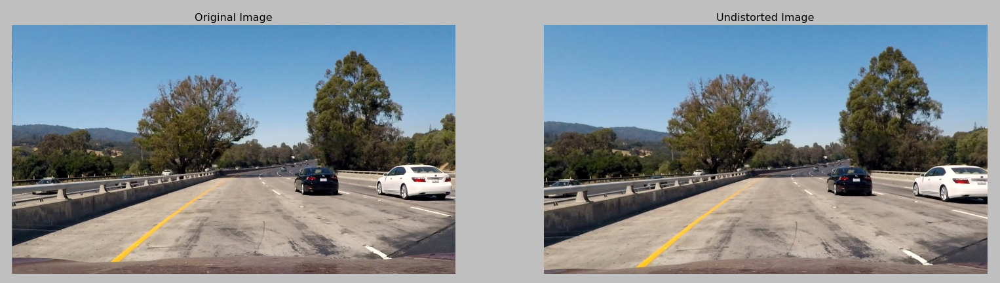
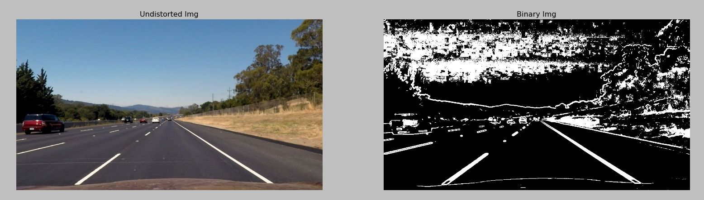
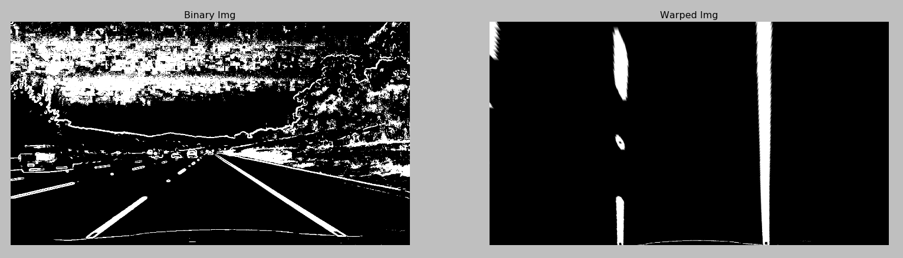
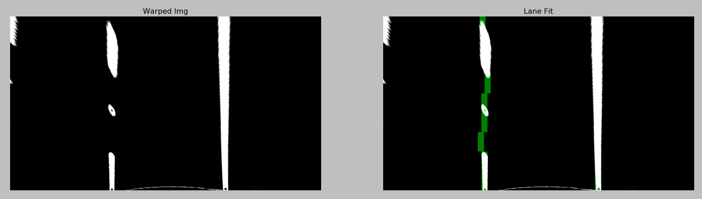
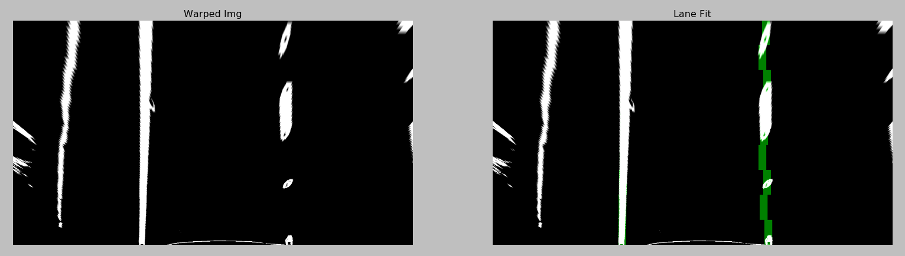
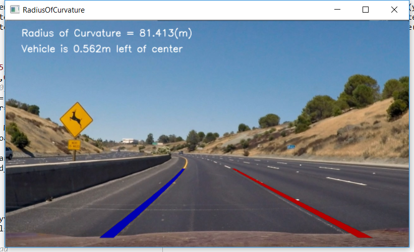

## Advanced Lane Finding
[](http://www.udacity.com/drive)


In this project, your goal is to write a software pipeline to identify the lane boundaries in a video, but the main output or product we want you to create is a detailed writeup of the project.  Check out the [writeup template](https://github.com/udacity/CarND-Advanced-Lane-Lines/blob/master/writeup_template.md) for this project and use it as a starting point for creating your own writeup.  


The Project
---

The goals / steps of this project are the following:

* Compute the camera calibration matrix and distortion coefficients given a set of chessboard images.
* Apply a distortion correction to raw images.
* Use color transforms, gradients, etc., to create a thresholded binary image.
* Apply a perspective transform to rectify binary image ("birds-eye view").
* Detect lane pixels and fit to find the lane boundary.
* Determine the curvature of the lane and vehicle position with respect to center.
* Warp the detected lane boundaries back onto the original image.
* Output visual display of the lane boundaries and numerical estimation of lane curvature and vehicle position.


### Camera Calibration

Used the 9x6 chessboard images provided in the repository for calibrating the camera and obtain mtx (camera matrix) and dist (distortion coefficients). Used these camera matrix and distortion coefficients to undistort the images. Below is an example:



Camera calibration details can be viewed in file 'calibrate_cam.py'. All corner points are picked up in line 23, saved into an array and are passed for calibrating camera in line 52 to obtain mtx and dist. Same are saved for later usage.

## Pipeline on single images (same is used for video)

### Apply distortion correction
Using the camera matrix and distortion coefficients applied distortion correction to the raw images from the video/test images provided. Undistorting an image is helpful for later transofrmations. And if this is not done, the distortion will propagate through all the later transofrmations inducing more errors.


The undistort is more evident near the edges. Left image has the white car fully visible while in the right image the boot (back part) is chopped off as a result of distortion correction. This is achieved by `img = cv2.undistort(img, mtx, dist, None, mtx)` on line 121 in 'video_gen.py' file. 

### Binary image using thresholds
The image is now ready for further process pipeline. Having experimented with various thresholds (more of an experimental process), I ended up with acceptable threholds and binary image using gradient on both x & y directions. Used Sobel kernel sized 3 (3x3 pixels). While this identified the yellow and white lanes well, they also generated a lot of other noise across the image. Selecting a Region of Interest (ROI) to choose only the road part didn't help much. All the various edges and color variations due to shadows and other conditions added noise.

Gradients binary is further enhanced by adding to it color thresholded binary. While on the highway, the lines are easily captured, over and around the bridge where the trees cast shadow and the road is much lighter than highway, the lanes are best identified with saturation channel for yellow (HLS) that did a very good job. Combining this with value channel of HSV color space has extracted the lane lines very well.



The code for obtaining the color thresholds is at lines 41-60 in 'video_gen.py' file. This is added to the gradients' binary using `preprocessImg[((gradx == 1) & (grady == 1) | (c_binary == 1))] = 255`. 

### Applying Perspective Transformation ('birds-eye view')

Next, applied a perspective transofrmation on the binary image to get the lane lines. Found this transformation challenging and the Q&A section from Udacity helped me gain better understanding hence results. Quite a bit of experimentation was required to arrive at acceptable coordinates for source and destination.



The source and destination points for this warping of image are obtained using the function `get_src_dst_points(img)` by passing the frame as parameter to the same. This is implemented in lines 125-140 in 'video_gen.py' file

Source points used for perspective transformation
`[[  530.   471.] [  750.   471.] [ 1190.   691.] [   89.   691.]]`
 
Destination points used for perspective transformation
`[[[ 320.    0.]] [[ 960.    0.]] [[ 960.  720.]] [[ 320.  720.]]]
`

Shown source points are obtained as result of the code mentioned above that are used for warp transformation of binary image.

### Finding lanes

This is the most challenging part of the project. Lecture notes and Q&A session were very handy and helpful in understanding the concepts. I also made use of the `tracker` class to find and store the identified left and right lane centroids to implement smoothening; by taking average of previous 'x' number of centroid tuples.

Each warped frame is divided into left and right blocks (two lanes) and each block is then sub-divided into several windows defined by the `window_height`.





#### Brief notes on how above lanes are identified
The initial centroids are found by identifying the left and right histogram peaks corresponding to the lane positions. Below code describes the process in detail and can be found in lines 32-35 of 'tracker.py' file.

`
l_sum = np.sum(warped[int(3*warped.shape[0]/4):, :int(warped.shape[1]/2)], axis=0)
l_center = np.argmax(np.convolve(window, l_sum)) - window_width/2
r_sum = np.sum(warped[int(3*warped.shape[0]/4):, int(warped.shape[1]/2):], axis=0)
r_center = np.argmax(np.convolve(window, r_sum)) - window_width/2 + int(warped.shape[1]/2)
`

Further centroids are found by finding the histogram peaks around these `l_center` and `r_center`s. Entire process is implemented in lines 23-59 in `find_window_centroids` function of 'tracker.py' file.


### Overlay the results back on original image and calculate lane curvature and car position

Having obtained the above centroids, the lane curvatures can be calculated. The left and right centroids are collected respectively into `leftx` and `rightx` lists. Using these the 2nd degree polynomial equation is found that fits to these centroids. This is implemented in lines 180-190 of 'video_gen.py' file. Now that we have the coefficients of left and right lane lines, we can generate smooth lines of 1 pixel and overlay them back on the original image for visualization.



We can now find the radius of curvature by first adjusting the pixel values fitted using 2nd degree polynomial equation above with the ratio of pixels per meter on image. Then using the formulae givven in lecture notes, the radius of curvature is calculated. Code snippet is shown below

`
ym_per_pix = curve_centers.ym
xm_per_pix = curve_centers.xm
curve_fit_cr = np.polyfit(np.array(res_yvals, np.float32)*ym_per_pix, np.array(leftx, np.float32)*xm_per_pix, 2)
curverad = ((1 + (2*curve_fit_cr[0]*yvals[-1]*ym_per_pix + curve_fit_cr[1])**2)**1.5) /np.absolute(2*curve_fit_cr[0])
`

Once we have the estimated radius of curvature, the difference between this and the center of the lane (-/+ correspond to left/right) tells us how far off is the car to the center of the lane. And these are displayed on the dashboard as shown in above picture.

## Output of project video


```python
from IPython.display import HTML
HTML("""
<video width="960" height="540" controls>
  <source src="{0}">
</video>
""".format('output_video.mp4'))
```


<video width="960" height="540" controls>
  <source src="output_video.mp4">
</video>


### Discussion

There is a lot to discuss on learning and issues faced. But to keep things short and crisp, major points are:
* Thresholding can be made more robust. Tried directional and magnitude thresholds and require more experimentation.
* Current pipeline suffers to stick to lanes near the warped image horizon particularly when road curves. This can be fixed, I think by better perspective transform points.
* Current thresholding and binary image is working fine for this video. Same needs to be made more robust for shadows and when the road color is much lighter like on the bridge.
* Implementing directional in addition to improving curent hue and saturation thresholds may make binary image better.
* I tried yellow lane and white lanes separately as below but that didn't yield a nice binary image when combined with graidient and color thresholds. Will continue to experiment, learn and improve results.

    `HSV = cv2.cvtColor(img, cv2.COLOR_BGR2HSV)`
    
    `yellow = cv2.inRange(HSV, (20, 100, 100), (50, 255, 255))`
    
    `yellow_img = cv2.bitwise_and(img, img, mask=yellow)`
    
    `white = cv2.inRange(img, (200,200,200), (255,255,255))`
    
    `white1_layer = cv2.bitwise_and(img, img, mask=white)`
    
    `combined = cv2.bitwise_or(white1_layer, yellow_img)`


* The centroid identification and tracking can be made better. One thing I like to try is the minimum number of pixels to consider during convolution and centroid calculation.
* One great learning take away in addition to many is the way to building pipeline to capture lane curvature and actually calculating the curvature of radius - was an aha!! moment for me.


```python

```
