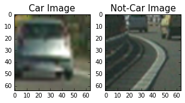
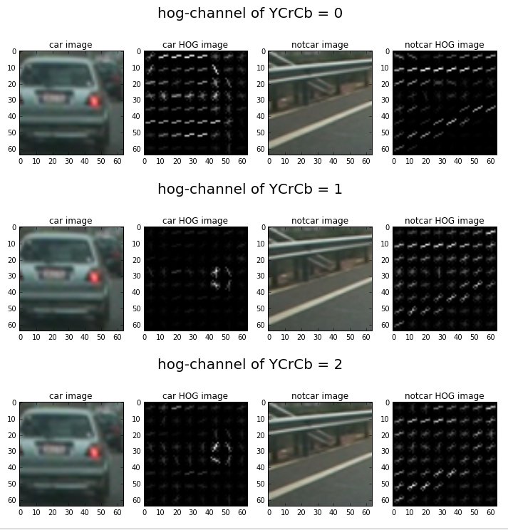
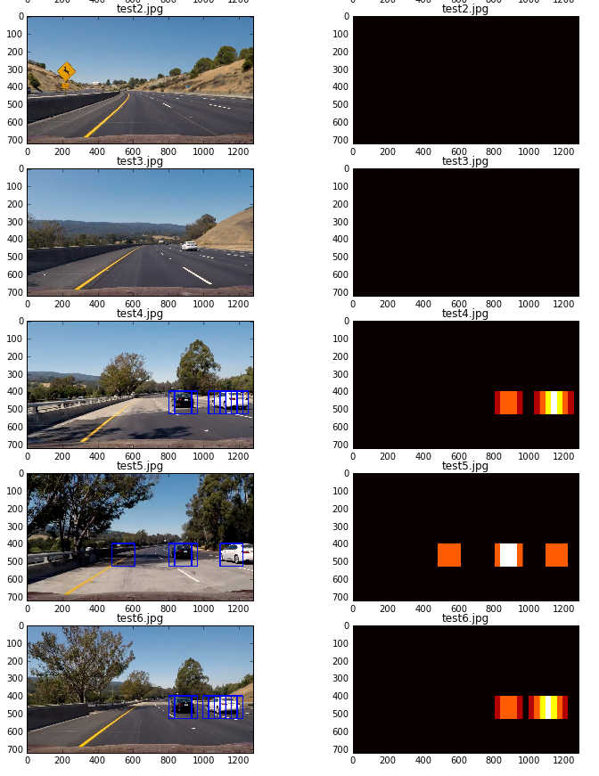
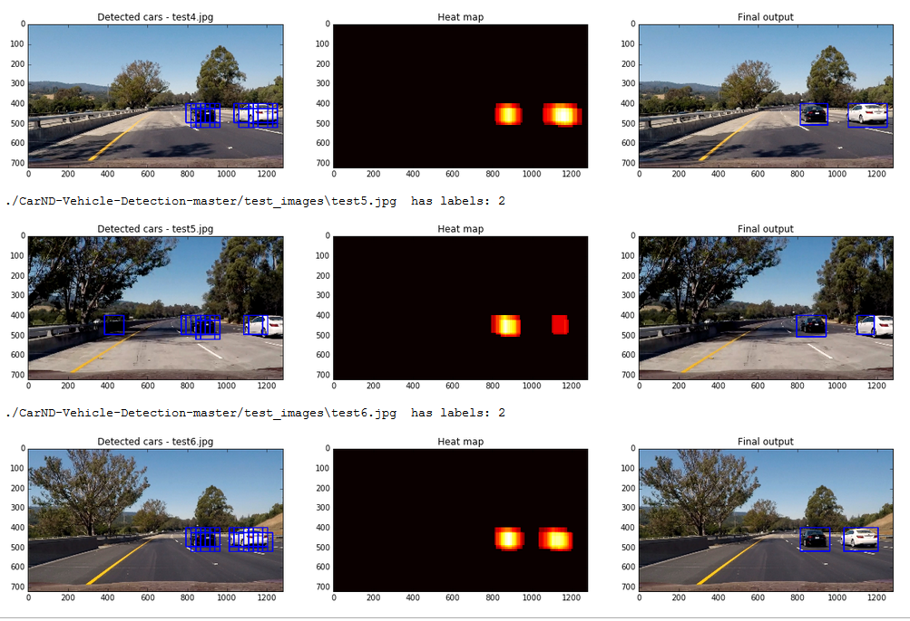

# **Vehicle Detection Project**

The goals / steps of this project are the following:

* Perform a Histogram of Oriented Gradients (HOG) feature extraction on a labeled training set of images and train a classifier Linear SVM classifier
* Optionally, you can also apply a color transform and append binned color features, as well as histograms of color, to your HOG feature vector. 
* Note: for those first two steps don't forget to normalize your features and randomize a selection for training and testing.
* Implement a sliding-window technique and use your trained classifier to search for vehicles in images.
* Run your pipeline on a video stream (start with the test_video.mp4 and later implement on full project_video.mp4) and create a heat map of recurring detections frame by frame to reject outliers and follow detected vehicles.
* Estimate a bounding box for vehicles detected.

### [Rubric](https://review.udacity.com/#!/rubrics/513/view) Points
### Here I will consider the rubric points individually and describe how I addressed each point in my implementation.  

### Histogram of Oriented Gradients (HOG)

The code for this step is contained in code cell [6] of my IPython notebook named P5_Vehicle_Detection_Tracking.ipynb

I started off by reading in all the `vehicle` and `non-vehicle` images from the provided repository. Below is an example of one of each of the classes.



I then explored different color spaces and various `skimage.hog()` parameters such as `orientations`, `pixels_per_cell` and `cells_per_block`. Experimented and visualized these parameters with various combinations of the same on random images of `vehicle` and `non-vehicle` classes to get a feel for how each of the outputs look like. Here's an example of the `hog` visualization with selected parameters `orientations=9`, `pixels_per_cell=(8, 8)` and `cells_per_block=(2, 2)`.



#### Selection of hog parameters

Having explored and played with different combinations of `hog` features, I understood that having too less of `orientations` resulted in a lot of gradient detail lost and only few angles of gradients are selected. And inverse happens when you select a higher number of `orientations`. I found the right balance of `orientations` at `9` and setttled with it.

Similarly for the `pixels_per_cell`, selecting a smaller number of pixels per each cell misses out quite a bit of detail making it difficult for the classifier learn detail. And on the contrary, choosing a larger number of pixels per each cell brings in a lot of detail. This can also result in accumulating unintended noise from the images thus affecting the classifier's accuracy negatively.

Finally similar argument holds for `cells_per_block`. This has a much more smaller range of values to choose from depending on the image and region of interest's resolution. Hence, exploring with different combinations of these three parameters, I settled with the above mentioned values that gave me satisfactory results.

These above results are obtained with color space `YCrCb`. I settled with this color space having experimented and explored with different other color spaces such as `RGB`, `HSV`, `LUV`, `YUV` and so on. There is a lot more that can be explored and experimented, however, in the interest of available time, I settled with this combination of parameters.

### Training classifier

I selected `SVM` as preferred classifier for its scalability and speed, implemented in code cell [11] of `P5_Vehicle_Detection_Tracking.ipynb`. `Decision Trees` is another good candidate among various other classifiers, but `decision trees` can tend to overfit to the data and also with this huge features set, I preferred to settle with `SVM`.

I used the default `rbf` kernel and obtained a good 99% accuracy with `C=0.1`. Selecting a larger value of `C` can result in overfitting of the training data so to avoid the same and to train a classifier that can generalize to the unseen data well, I settled with this `C=0.1` value.

### Sliding window search

For this, initially I used the code from lessons and experimenting with different window sizes and spans (region of interests). Having gained a decent intuition of the concept, I used the HOG subsampling concept and code from lesson to do the sliding windows search.

Initially, I searched the entire lower half of the image with three different scales and consolidated their heatmaps for futher processing. Since, this took up a lot of time, I resorted to the tips and tricks as suggested in the lesson to search only selected regions of interest.

So, I experimented with different spans and scale factors and settled with below combination. Below is a snapshot of the span and sliding window sizes used.
`scales = [1, 1.3, 1.5, 1.7, 2]`
`ystart = [400, 400, 400, 400, 400]`
`ystop = [552, 571, 596, 615, 656]`


The rationale is same as suggested in the classroom - the further away from camera, the smaller the car sizes are hence, smaller window size and smaller span. And closer to the camera are larger cars and hence a bigger sliding window and a greater region of interest. One point to note here however, is that I left the `ystart` as constant for all the spans. This is in the interest of available time. But same can be selected rigorously to make the process even more efficient and run faster.

### Pipeline

Having selected reasonable features as mentioned above including `color histogram features`, `spatial features` and `HOG features`, implemented a pipeline that takes in each frame from the video and returns an image with final bounding boxes drawn as output. This is implemented in code cell [25] of `P5_Vehicle_Detection_Tracking.ipynb`.

A brief description of my pipeline:
 - Read in each frame from the video.
 - Obtain heatmaps for each scale factor and span selected.
 - Add up all heatmaps from different scaling factors.
 - Average them with previous frames' heatmaps (this is another hyper-parameter that can be played with - number of frames used to average)
 - Apply a threshold to remove false positives
 - Buffer this heatmap to compute future frames' heatmaps.
 - Draw the bounding box based on the labels and their positions
 - Return the image with bounding boxes drawn

### Pipeline intermediate results

##### Identified bounding boxes with cars and the corresponding heatmaps.




##### Final output boxes after thresholding heat maps


### Video implementation

Below is my output video from the pipeline described above. The `scipy.ndimage.measurements.label()` library is a great time and effort saver. Used this to identify each car separately and draw bounding boxes around the car blobs from the heatmaps.


```python
from IPython.display import HTML

output = 'project_output.mp4'
HTML("""
<video width='960', height='540' controls>
    <source src="{0}">
</video>
""".format(output))
```


<video width='960', height='540' controls>
    <source src="project_output.mp4">
</video>


### Discussion


Here I will briefly discuss my learning points, possible failure of my pipeline and what can be improved upon.

First, it's been a wonderful learning with somany aha! moments. Very steep learning curve but enjoyed every moment of it. Few major learning points are:
 - Color histograms
 - Spatial binning of features
 - HOG features
 - Scaling and normalizing
 - Various sliding window and search techniques
 - label library from scipy.image
 - heatmap averaging over frames
 
Coming to talk of issues and failures, there are quite many improvements that can be implemented.
 - The HOG features with other color spaces can be explored to see if feature selection can be improved for better results.
 - The identified bounding boxes are still wobbly and not smooth. Needs improvement.
 - In addition to false positives, there are also false negatives that are withnessed calling for better trained classifier. Although this is covered up by averaging over frames, is not a robust approach.
 - Currently, failed to track each car independently. using averages of heatmap and labels may not work very well in cases of occlusion and when there are more than one car at the same distance from camera say on two different lanes.
 - Although I have implemented different spans for different scaling factors, things can be improved by restricting the span region with `ystart` too.

Given to understand the tracking can be improved with better accuracy with `Kalman Filters` that are taught in future. Look forward for more learning.

Despite all the above mentioned improvement requirements, this has been farily decent implementation of concepts covered and learned. I am pleased with current result and will be working to make things better.


```python

```
